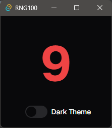
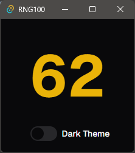
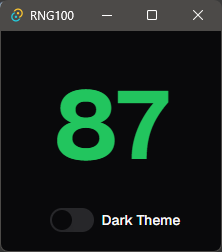
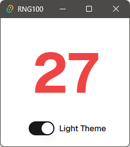
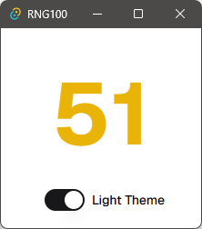
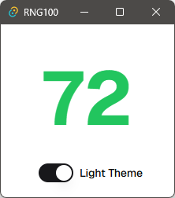

# RNG-100

RNG-100 is a tiny app that just generates a number from 1 to 100.

<p style="text-align:center">



</p>

<p style="text-align:center">



</p>

## Development

```bash
# start dev server and dev build tauri app
just tauri-dev
# release build tauri app
just tauri-build
# start only frontend dev server
just webdev
# build only frontend
just webbuild
# release application (use git-bash on Windows)
just release
# or dry-run
just release-dry-run
```
